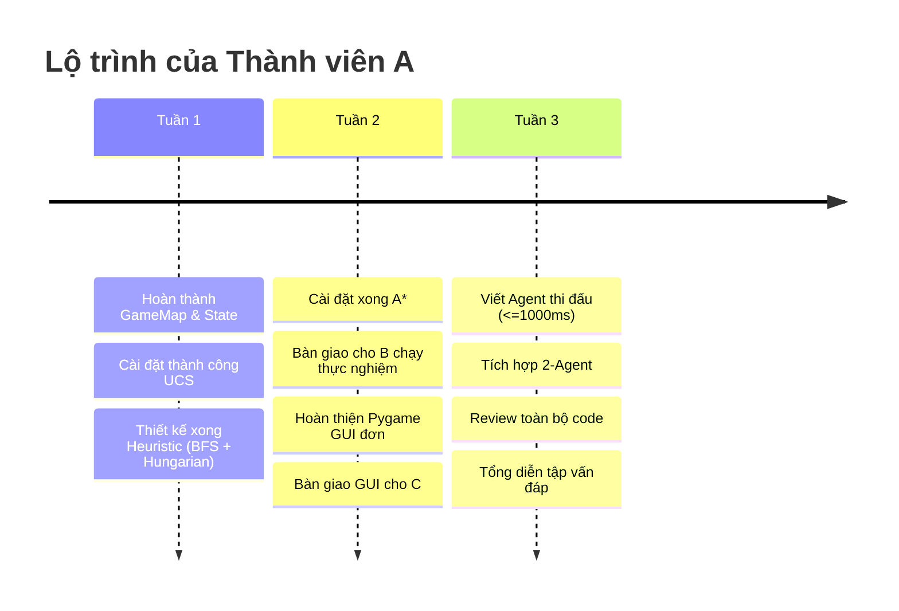

# Bảng Kế Hoạch & Thứ Tự Thực Hiện — Thành Viên A (Trưởng Nhóm)

> **Vai trò:** Trưởng nhóm (Phụ trách 50% khối lượng kỹ thuật cốt lõi)  
> **Các phần phụ trách chính:** OOP Core, Req 2 (UCS, A*, Heuristic), Req 5 (Pygame GUI), Req 7 (Thuật toán thi đấu Agent).

---

## 1. Bảng Lộ Trình Thực Hiện Từng Bước (Step-by-Step)

| Bước | File code | Nhiệm vụ chính | Logic trọng tâm cần tự viết | Đầu ra bàn giao cho B & C | Thời gian ước lượng |
| :---: | :--- | :--- | :--- | :--- | :---: |
| **1** | `source/task1/game_map.py` | Đọc & quản lý bản đồ | - Đọc file text, phân loại tọa độ: tường (`%`), đích (`D`), hộp (`B`), hộp tại đích (`C`), người (`A`). - Thuật toán BFS tìm tập các ô sàn (`floor_cells`) bên trong tường. - Các hàm kiểm tra: `is_wall`, `is_free`, `get_neighbors`. | Thành viên B có bản đồ để mô hình hóa trạng thái (Req 1). | Ngày 1 - 2 |
| **2** | `source/task1/state.py` | Biểu diễn trạng thái & sinh bước đi | - Lưu `agent_pos` (tuple) và `boxes` (dùng `frozenset` để hash được). - Hàm `is_goal(goals)`: kiểm tra toàn bộ đích đã có hộp chưa. - Hàm `get_successors(game_map)`: tính 4 hướng đi (N, S, E, W), xử lý đẩy hộp (kiểm tra ô sau hộp) và đi vào ô trống. - Cài đặt `__eq__`, `__hash__`, `__lt__`. | Bàn giao để B và A cùng kiểm tra sinh trạng thái. | Ngày 3 - 4 |
| **3** | `source/task1/solver.py` *(Phần UCS)* | Thuật toán UCS (Uniform Cost Search) | - Dùng `heapq` làm Priority Queue (`frontier`), chi phí ưu tiên là $g(n)$. - Quản lý tập `explored` bằng `set`. - Dict `came_from` để lưu vết cha và hành động tương ứng. - Hàm `_reconstruct_path` đảo ngược danh sách action từ đích về gốc. - Đếm `nodes_expanded` và `max_frontier_size`. | Bắt đầu chạy được lời giải trên bản đồ nhỏ. Bàn giao cho B viết khung `experiment.py`. | Ngày 5 - 6 |
| **4** | `source/task1/heuristic.py` | Thiết kế Heuristic (BFS + Hungarian) | - **Hàm `bfs_distance(start, end, map)`:** Tìm đường ngắn nhất qua ô trống tránh tường (không dùng Manhattan/Euclidean). - Xây dựng ma trận chi phí giữa các hộp chưa vào đích và các đích còn trống. - Dùng `scipy.optimize.linear_sum_assignment` (thuật toán Hungarian) để ghép nối cặp tối ưu. - *(Tùy chọn nâng cao)*: Hàm `is_deadlock` lọc sớm các hộp bị kẹt góc tường. | Bàn giao cho B bắt đầu kiểm chứng Admissible & Consistent (Req 4). | Ngày 7 - 9 |
| **5** | `source/task1/solver.py` *(Phần A\*)* | Thuật toán A* Search | - Cài đặt A* dựa trên khung của UCS nhưng độ ưu tiên sắp xếp là $f(n) = g(n) + h(n)$. - Cập nhật điều kiện mở rộng node: nếu gặp trạng thái đã có trong frontier với $g$ mới tốt hơn thì cập nhật. - Kiểm tra đảm bảo kết quả tổng chi phí ($cost$) phải bằng đúng với UCS. | Bàn giao trọn vẹn Solver cho B thực hiện toàn bộ đo đạc Req 3. | Ngày 10 - 11 |
| **6** | `source/task1/gui.py` & `main.py` | Giao diện Pygame đơn (Single-player) | - Vẽ bản đồ (tường, sàn, đích, hộp, hộp trên đích, agent). - Panel hiển thị: tên thuật toán, bước hiện tại/tổng bước, cost, số node. - Bắt sự kiện bàn phím: &nbsp;&nbsp;+ `Space`: Tạm dừng / tiếp tục tự động chạy. &nbsp;&nbsp;+ `Phím phải (→)`: Tiến 1 bước. &nbsp;&nbsp;+ `Phím trái (←)`: Lùi 1 bước. &nbsp;&nbsp;+ Menu/console cho chọn UCS hoặc A*. | Hoàn thành Req 5. Bàn giao file GUI hoàn chỉnh để C làm tiếp Req 8 (chế độ 2 người). | Ngày 12 - 14 |
| **7** | `source/task1_competitive/agent_algorithm.py` | Thuật toán Agent thi đấu (Req 7) | - File độc lập có class `Agent` với phương thức `choose_action(game_state)`. - Tối ưu tốc độ: đảm bảo ra quyết định trong **dưới 1000 ms**. - Chiến lược đề xuất: Greedy Best-First Search hoặc A* cục bộ (tìm hộp gần nhất và đích gần nhất, tìm vị trí đứng sau hộp để đẩy). - Cơ chế phòng thủ/tránh va chạm: né đối thủ nếu ô dự kiến đi bị trùng. | Bàn giao cho C tích hợp vào `competitive_gui.py` và chạy thử nghiệm. | Ngày 15 - 17 |
| **8** | Toàn bộ dự án | Tổng kiểm tra & Hỗ trợ chuẩn bị vấn đáp | - Hỗ trợ B hoàn thiện số liệu bảng biểu thí nghiệm (Req 3, 4). - Hỗ trợ C chạy thử và quay video demo (Req 8, Task 2). - Test dự án trên môi trường theo yêu cầu đề bài (macOS / Python chuẩn). - Cùng nhóm ôn tập bộ câu hỏi vấn đáp trong `giai_thich_thuat_toan.md`. | Toàn bộ sản phẩm hoàn thiện sẵn sàng nộp bài. | Tuần 3 (Ngày 18 - 21) |

---

## 2. Chi Tiết Các Cột Mốc Theo Tuần

---

## 3. Checklist Tự Kiểm Tra Nghiệm Thu (Acceptance Criteria)

Trước khi chuyển sang bước tiếp theo, hãy tự kiểm tra các tiêu chí sau:

- [ ] **Sau Bước 1 & 2:** Chạy thử đọc file `example_map.txt`, in ra console thấy đúng tọa độ, hàm `get_successors` sinh đủ các hướng đi hợp lệ và không đi xuyên tường.
- [ ] **Sau Bước 3:** UCS tìm được đường đi trên bản đồ mẫu, in ra danh sách hành động và tổng cost.
- [ ] **Sau Bước 4:** Hàm `calculate_heuristic` trả về giá trị số hợp lệ ($\ge 0$), bằng 0 khi tất cả hộp đã nằm trên đích. Tuyệt đối **không** dùng công thức Manhattan/Euclidean.
- [ ] **Sau Bước 5:** A* tìm ra kết quả có **cùng tổng cost với UCS**, nhưng số lượng node mở rộng (`nodes_expanded`) **phải ít hơn rõ rệt** so với UCS.
- [ ] **Sau Bước 6:** Chạy GUI pygame mượt mà, ấn `Space` dừng/chạy được, ấn `←` và `→` lùi tiến được từng bước, hiển thị rõ số bước trên màn hình.
- [ ] **Sau Bước 7:** Hàm `choose_action` của agent không bao giờ bị đơ quá 1 giây (1000ms), không gây crash khi không tìm thấy đường đi.
